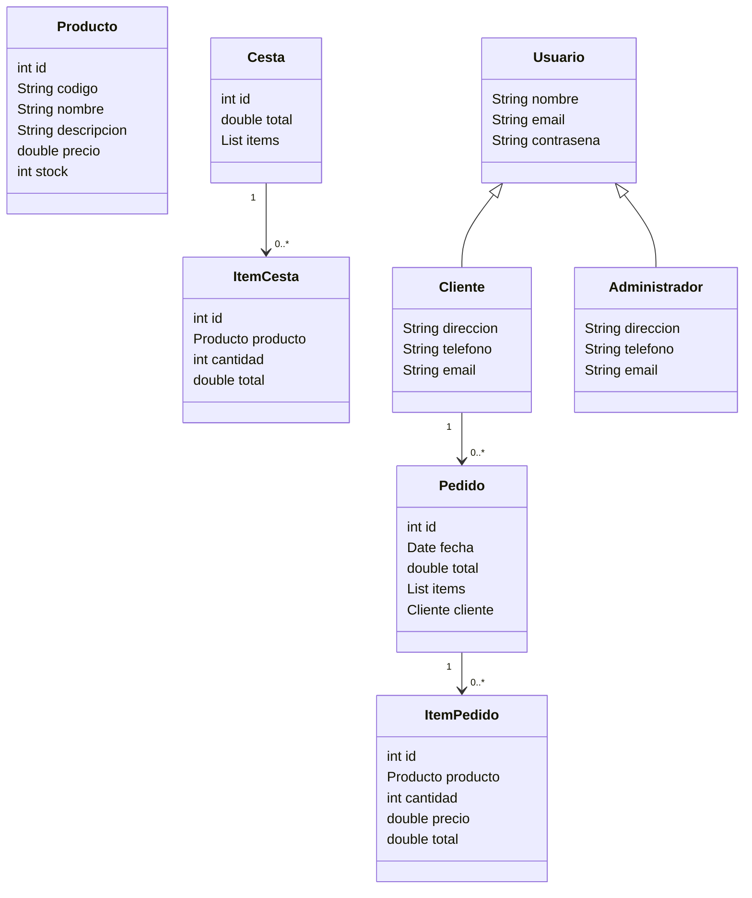

## Ejercicio 2: Diagrama de Clases

### Identificación de Clases, Atributos y Métodos

1. **Producto**
   - Atributos: id, codigo, nombre, descripcion, precio, stock
2. **Cesta**
   - Atributos: id, total, lista de items
3. **ItemCesta**
   - Atributos: id, producto, cantidad, total
4. **Usuario**
   - Atributos: nombre, email, contraseña
5. **Cliente** (hereda de Usuario)
   - Atributos: nombre, direccion, telefono, email
6. **Administrador** (hereda de Usuario)
   - Atributos: nombre, direccion, telefono, email
7. **Pedido**
   - Atributos: id, fecha, total, lista de items, cliente
8. **ItemPedido**
   - Atributos: id, producto, cantidad, precio, total

### Relaciones entre las Clases y Cardinalidad

- **Cliente** y **Pedido**: 1 a muchos
- **Cesta** y **ItemCesta**: 1 a muchos
- **Pedido** y **ItemPedido**: 1 a muchos

### Diagrama de Clases en Mermaid

