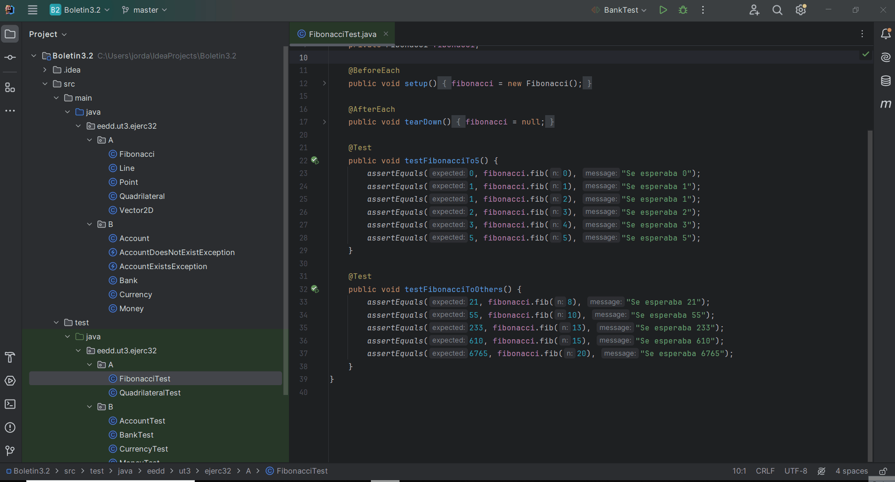
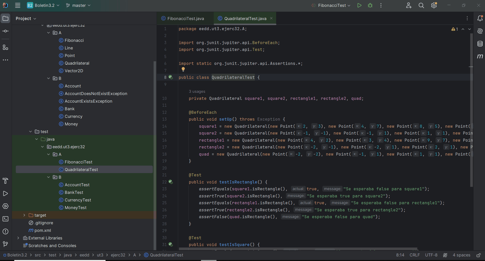
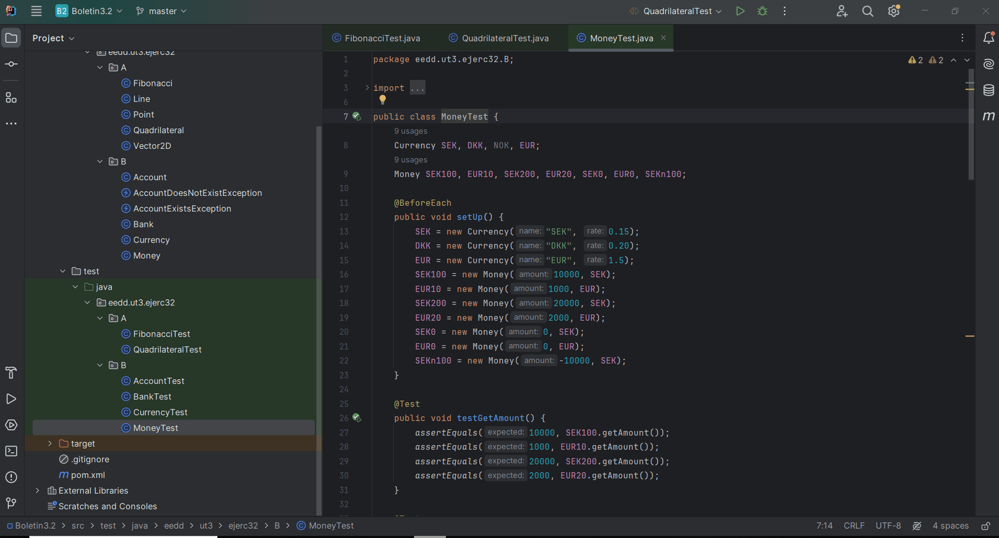
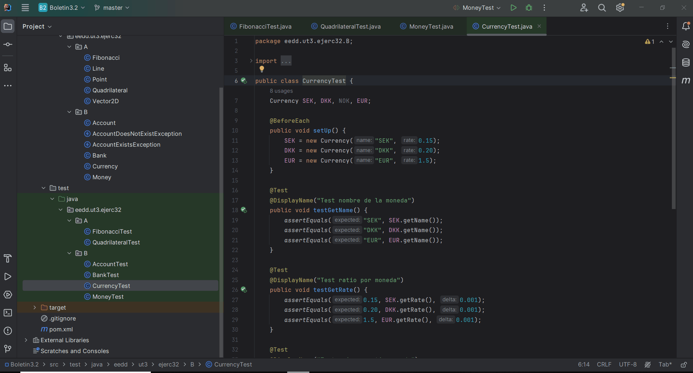
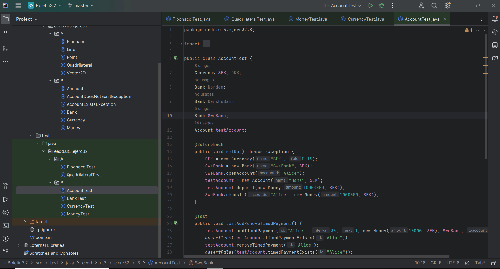
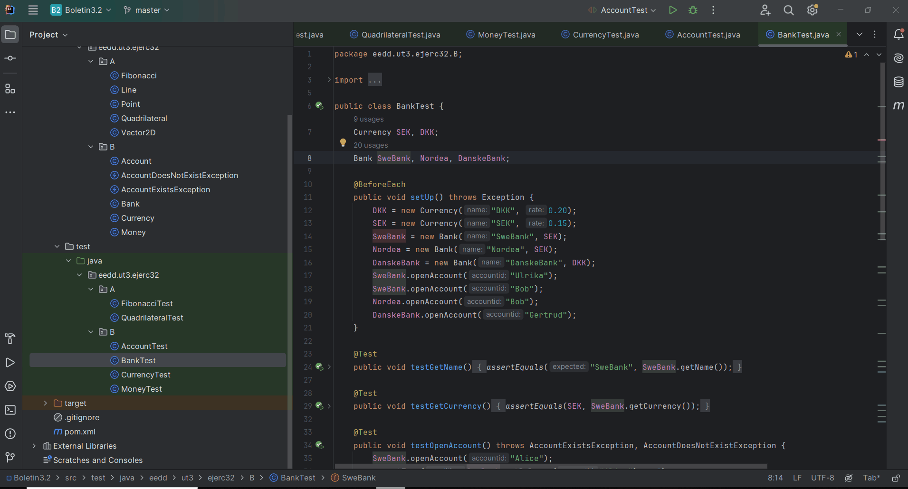

# Boletín 3.2. Unit Testing con JUnit 5

## Ejercicio 3.2.1. Fibonacci

### Clase FibonacciTest

La clase `FibonacciTest` contiene los métodos de prueba para la clase `Fibonacci`.

#### Método testFibonacciTo5

Comprueba que el método `fib` de la clase `Fibonacci` devuelve el valor esperado para los valores de `n` de 0 a 5.

#### Método testFibonacciToOthers

Comprueba que el método `fib` de la clase `Fibonacci` devuelve el valor esperado para los valores de `n` de 8, 10, 13, 15 y 20.

## Ejercicio 3.2.2. Cuadrilátero

### Clase QuadrilateralTest

La clase `QuadrilateralTest` contiene los métodos de prueba para la clase `Quadrilateral`.

#### Método testIsRectangle

Comprueba que el método `isRectangle` de la clase `Quadrilateral` devuelve el valor esperado para diferentes cuadriláteros.

#### Método testIsSquare

Comprueba que el método `isSquare` de la clase `Quadrilateral` devuelve el valor esperado para diferentes cuadriláteros.

## Ejercicio 3.2.3. Dinero y Moneda

### Clase MoneyTest

La clase `MoneyTest` contiene los métodos de prueba para la clase `Money`.

#### Métodos de test

Rellenado los métodos de test con los asserts correspondientes para comprobar el comportamiento de la clase `Money`.

### Clase CurrencyTest

La clase `CurrencyTest` contiene los métodos de prueba para la clase `Currency`.

#### Métodos de test

Rellenado los métodos de test con los asserts correspondientes para comprobar el comportamiento de la clase `Currency`.

## Ejercicio 3.2.4. Bancos y Cuentas

### Clase AccountTest

La clase `AccountTest` contiene los métodos de prueba para la clase `Account`.

#### Nota

Modificado el código de la clase `Account` para que los tests pasen correctamente.

### Clase BankTest

La clase `BankTest` contiene los métodos de prueba para la clase `Bank`.

#### Métodos de test

Rellenado los métodos de test con los asserts correspondientes para comprobar el comportamiento de la clase `Bank`.

