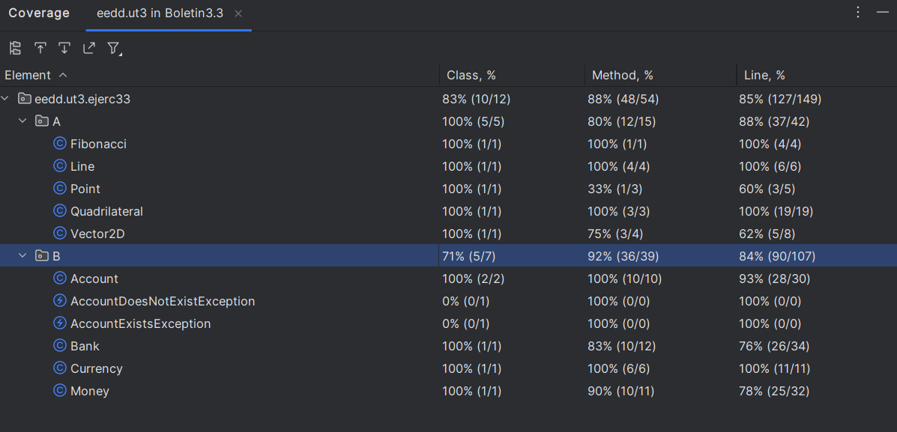
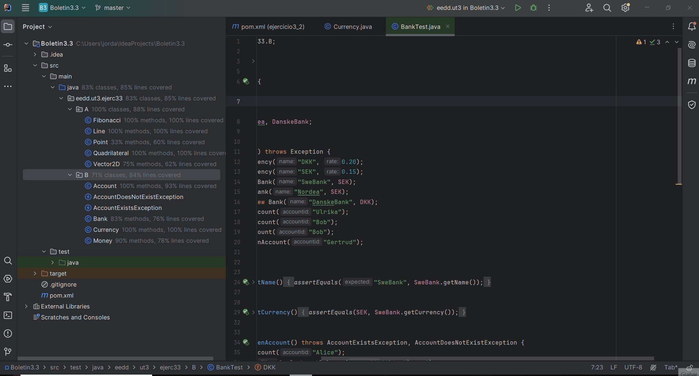
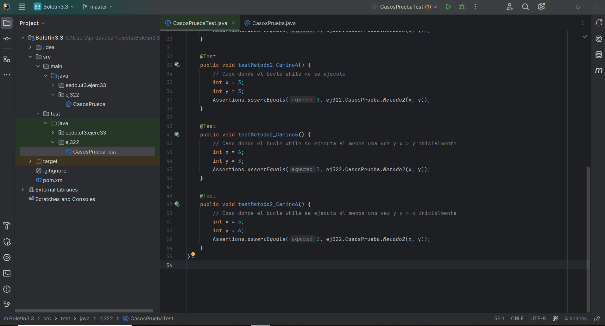

# Ejercicio 3.3 - Unit Testing con Cobertura de Código

## 3.3.0 Ejecutar los test de cobertura de código inicial

### Captura de Pantalla de la Cobertura de Código Inicial

## Ejercicio 3.2.1. Métricas a conseguir

Se debe conseguir una cobertura de código mínima para el proyecto del 80%.

### Captura de Pantalla de la Cobertura de Código Final

Al hacer el coverage inicial me he dado cuenta de que me da el coverage que necesitaba por eso es la misma imagen.

### GIF de la Realización de los Test con Cobertura

## Ejercicio 3.2.2. Cobertura de Ramas

