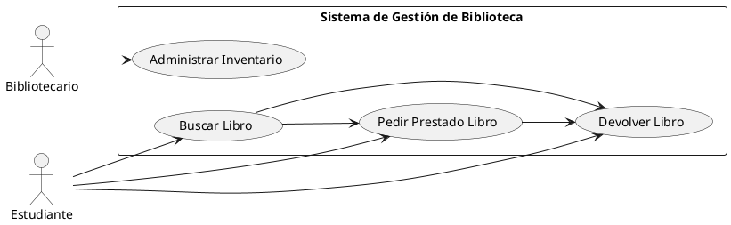
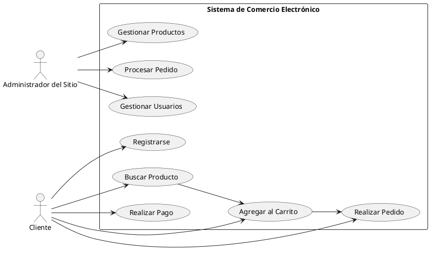
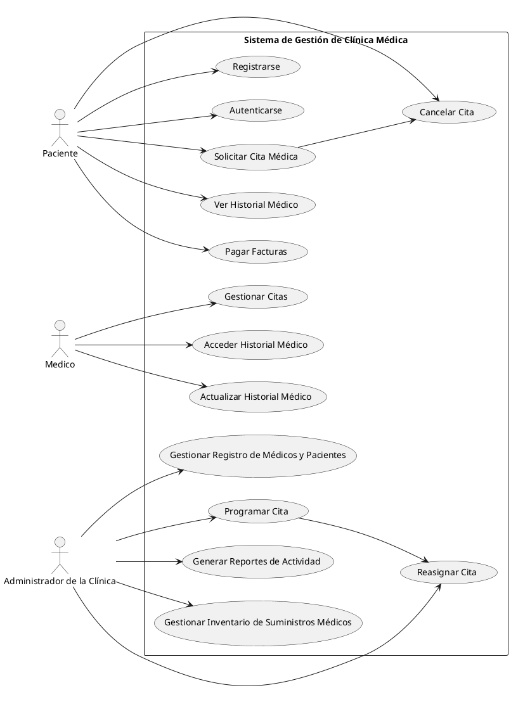

## Ejercicio 1

### Identificación de los Actores Principales

1. **Estudiante**: Los estudiantes son los usuarios principales del sistema de gestión de biblioteca. Pueden buscar libros, pedir prestados libros y devolver libros.
2. **Bibliotecario**: El bibliotecario es el encargado de administrar el inventario de libros. Puede agregar nuevos libros, eliminar libros antiguos, actualizar la información de los libros y gestionar los préstamos.

### Casos de Uso Principales

1. **Buscar Libro**: Los usuarios pueden buscar libros disponibles en la biblioteca.
2. **Pedir Prestado Libro**: Los estudiantes pueden solicitar el préstamo de un libro.
3. **Devolver Libro**: Los estudiantes pueden devolver un libro prestado una vez que han terminado con él.
4. **Administrar Inventario**: El bibliotecario puede administrar el inventario de libros, incluyendo agregar nuevos libros, eliminar libros antiguos y actualizar la información de los libros.

### Diagrama de Casos de Uso

## Ejercicio 2

### Identificación de los Actores Principales

1. **Cliente**: Los clientes son los usuarios principales del sistema de comercio electrónico. Pueden registrarse, buscar productos, agregar productos al carrito, realizar pedidos y realizar pagos en línea.
2. **Administrador del Sitio**: El administrador del sitio es responsable de gestionar el inventario de productos, procesar pedidos y manejar los datos de los usuarios.

### Casos de Uso Principales

#### Para el Actor Cliente:

1. **Registrarse**: El cliente debe proporcionar detalles personales para crear una cuenta en el sistema.
2. **Buscar Producto**: Los clientes pueden buscar productos por categoría, nombre o palabra clave.
3. **Agregar al Carrito**: Los clientes pueden agregar productos seleccionados al carrito de compras.
4. **Realizar Pedido**: Los clientes pueden finalizar su compra y realizar un pedido de los productos en su carrito.
5. **Realizar Pago**: Los clientes pueden realizar pagos en línea para completar su compra.

#### Para el Actor Administrador del Sitio:

1. **Gestionar Productos**: El administrador puede agregar, editar, eliminar y actualizar información sobre los productos en el inventario.
2. **Procesar Pedido**: El administrador del sitio puede revisar y procesar los pedidos realizados por los clientes.
3. **Gestionar Usuarios**: El administrador puede acceder y gestionar la información de los usuarios registrados en el sistema.

### Diagrama de Casos de Uso

## Ejercicio 3

### Identificación de los Actores Principales

1. **Paciente**: Los pacientes son los usuarios principales del sistema de gestión de la clínica médica. Pueden registrarse, solicitar citas, ver su historial médico, pagar facturas en línea y cancelar citas.
2. **Médico**: Los médicos utilizan el sistema para gestionar las citas de los pacientes, acceder y actualizar los historiales médicos de los pacientes, y añadir notas médicas a los historiales.
3. **Administrador de la Clínica**: El administrador de la clínica tiene funciones administrativas clave, como gestionar el registro de médicos y pacientes, programar y reasignar citas, generar reportes de actividad de la clínica y gestionar el inventario de suministros médicos.

### Casos de Uso Principales

#### Para el Actor Paciente:

1. **Registrarse**: Los pacientes pueden registrarse en el sistema proporcionando sus detalles personales.
2. **Autenticarse**: Los pacientes deben autenticarse ingresando su nombre de usuario y contraseña para acceder a su cuenta.
3. **Solicitar Cita Médica**: Los pacientes pueden solicitar citas con los médicos disponibles.
4. **Ver Historial Médico**: Los pacientes pueden ver su historial médico, incluyendo diagnósticos anteriores, tratamientos y recetas.
5. **Pagar Facturas**: Los pacientes pueden pagar sus facturas médicas en línea.
6. **Cancelar Cita**: Los pacientes pueden cancelar citas previamente programadas si es necesario.

#### Para el Actor Médico:

1. **Gestionar Citas**: Los médicos pueden ver y gestionar las citas programadas con los pacientes.
2. **Acceder Historial Médico**: Los médicos pueden acceder al historial médico de los pacientes para revisar diagnósticos anteriores, tratamientos y recetas.
3. **Actualizar Historial Médico**: Los médicos pueden actualizar el historial médico de los pacientes, añadiendo nuevas notas médicas, diagnósticos o tratamientos.

#### Para el Actor Administrador de la Clínica:

1. **Gestionar Registro de Médicos y Pacientes**: El administrador puede agregar, editar y eliminar médicos y pacientes del sistema.
2. **Programar Cita**: El administrador puede programar citas para pacientes y asignarlas a médicos disponibles.
3. **Reasignar Cita**: El administrador puede reasignar citas en caso de necesidad, por ejemplo, si un médico no está disponible.
4. **Generar Reportes de Actividad**: El administrador puede generar informes que muestren la actividad de la clínica, como el número de citas realizadas, facturas pagadas, etc.
5. **Gestionar Inventario de Suministros Médicos**: El administrador puede gestionar el inventario de suministros médicos, incluyendo la adición, eliminación y actualización de existencias.

### Diagrama de Casos de Uso

